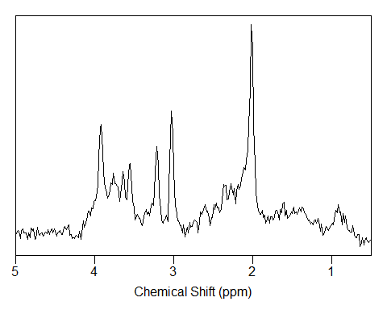
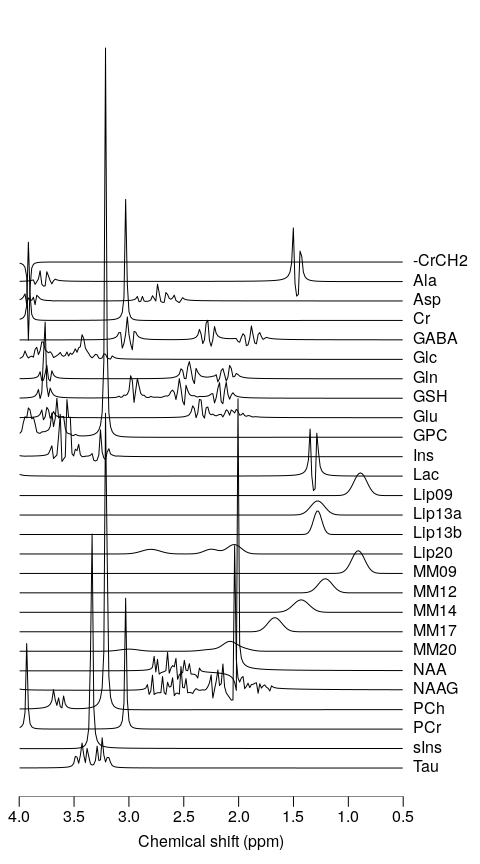
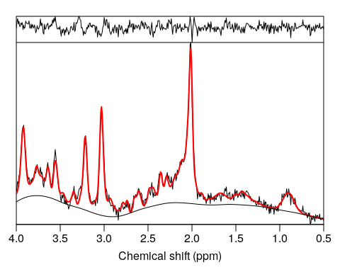

<!-- README.md is generated from README.Rmd. Please edit that file -->
spant
=====

Overview
--------

spant provides a full suite of tools to build automated anaysis pipelines for Magnetic Resonance Spectroscopy (MRS) data. The following features are included:

-   Raw data import/export.
-   Flexable data types to support single voxel, dynamic and spectroscopic imaging data types.
-   Publication quality plotting.
-   Extensive set of pre-processing steps (phasing, zero-filling, HSVD filtering...)
-   Quantum mechanical based simulation for experimental design and basis-set generation.
-   Set of metabolite, macromolecule and lipid parameters for typical brain analyses.
-   VARPRO based fitting and interfaces for TARQUIN and LCModel for metabolite quantitation.
-   Voxel registration to anatomical images for partial volume concentration corrections.

Installation
------------

You can install the stable version of spant from CRAN:

``` r
install.packages("spant")
```

Or the the development version from GitHub (requires `devtools` package):

``` r
# install.packages("devtools")
devtools::install_github("martin3141/spant")
```

Usage
-----

``` r
library(spant)
fname <- system.file("extdata", "philips_spar_sdat_WS.SDAT", package = "spant")

# import raw data
mrs_data <- read_mrs(fname, format = "spar_sdat")

# output basic data structure
print(mrs_data)
#> MRS data parameters
#> -------------------------------
#> Trans. freq (MHz)       : 127.786142
#> FID data points         : 1024
#> X,Y,Z dimensions        : 1x1x1
#> Dynamics                : 1
#> Coils                   : 1
#> Voxel resolution (mm)   : NAxNAxNA
#> Sampling frequency (Hz) : 2000
#> Contains referece data  : FALSE
#> Spectral domain         : FALSE
#> Reference freq. (PPM)   : 4.65

# plot data in the frequency domain
plot(mrs_data, xlim = c(5, 0.5))
```


``` r
# apply water filter and align to tNAA resonance
mrs_proc <- hsvd_filt(mrs_data)
mrs_proc <- align(mrs_proc, 2.01)
plot(mrs_proc, xlim = c(5, 0.5))
```



``` r
# get the data acquistion paramters
acq_paras <- get_acq_paras(mrs_proc)

# simulate a typical basis set for short TE brain analysis
basis <- sim_basis_1h_brain_press(acq_paras)

# output basis info
print(basis)
#> Basis set parameters
#> -------------------------------
#> Trans. freq (MHz)       : 127.786142
#> Data points             : 1024
#> Sampling frequency (Hz) : 2000
#> Elements                : 27
#> 
#> Names
#> -------------------------------
#> -CrCH2,Ala,Asp,Cr,GABA,Glc,Gln,
#> GSH,Glu,GPC,Ins,Lac,Lip09,
#> Lip13a,Lip13b,Lip20,MM09,MM12,
#> MM14,MM17,MM20,NAA,NAAG,PCh,
#> PCr,sIns,Tau

# plot basis signals
stackplot(basis, xlim = c(4, 0.5))
```



``` r
# perform VARPRO fitting to processed data
fit_res <- fit_mrs(mrs_proc, basis)
#> 
  |                                                                       
  |                                                                 |   0%
  |                                                                       
  |=================================================================| 100%

# plot the fit estimate, residual and baseline
plot(fit_res)
```


