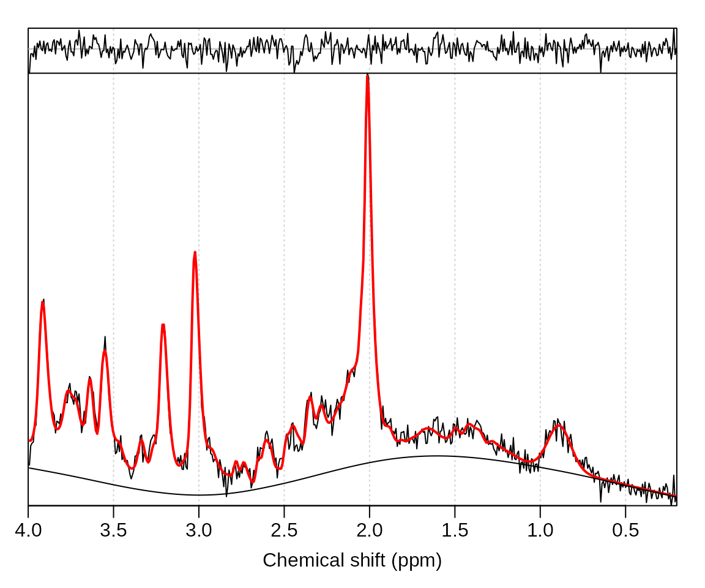
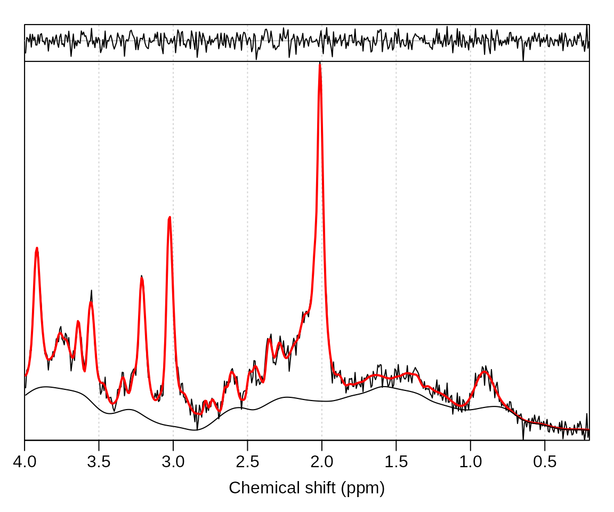
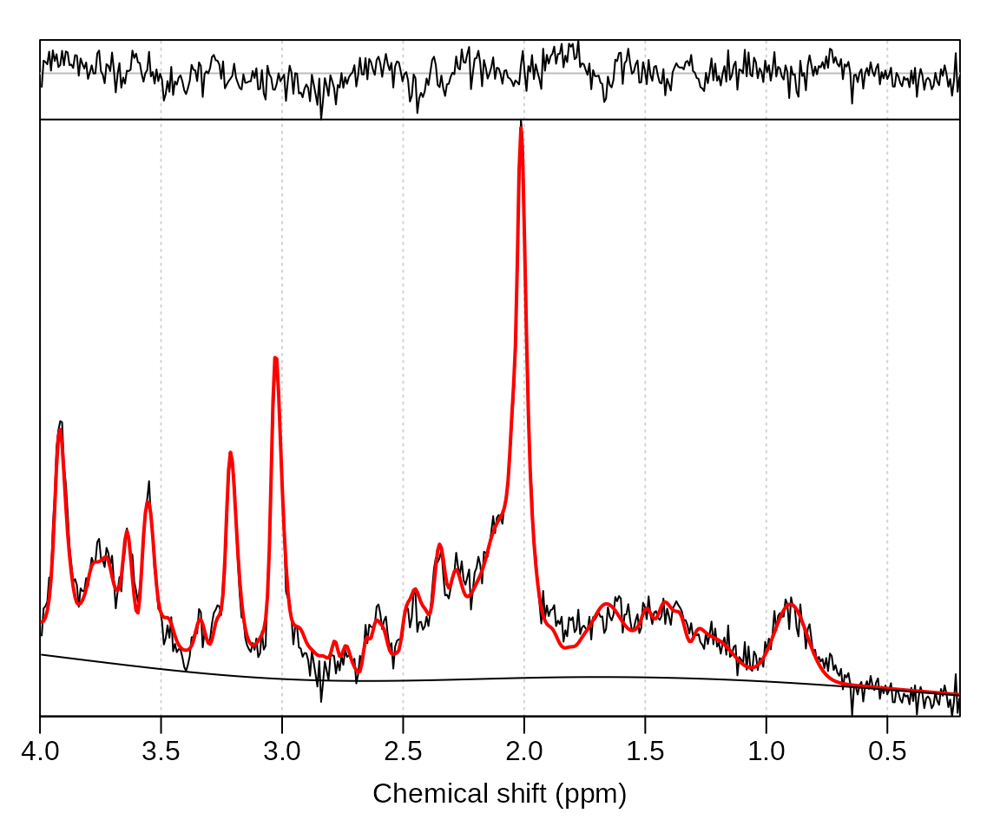
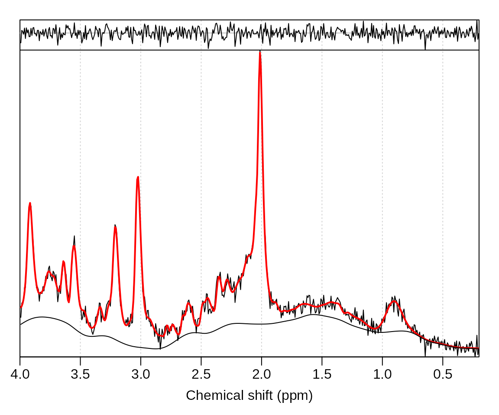
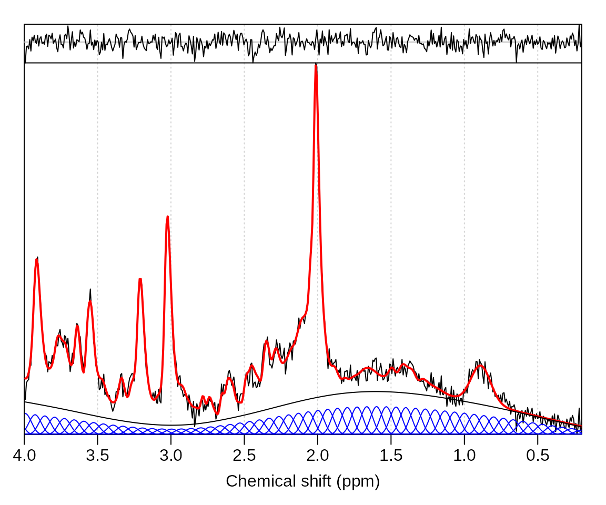
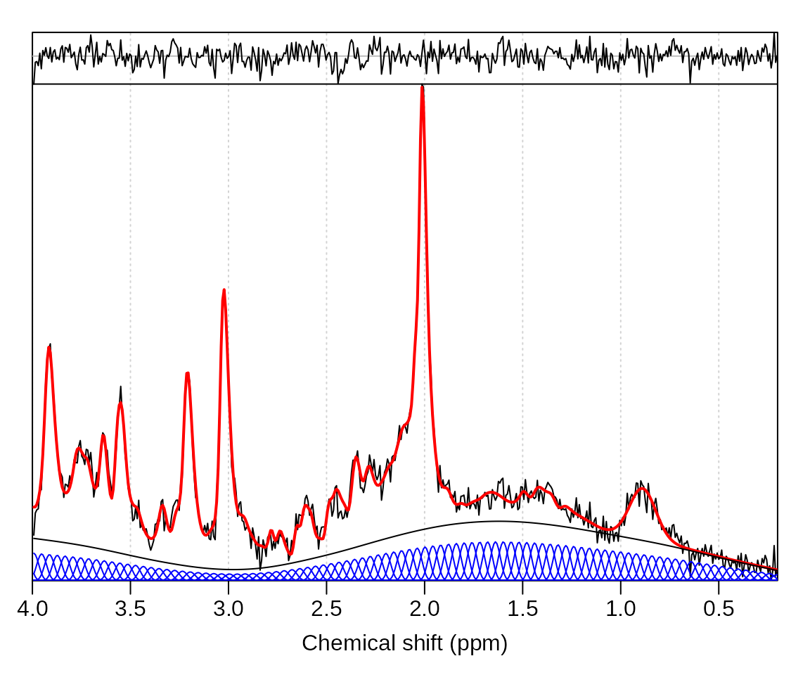

# ABfit baseline options

## Introduction

A good baseline estimate is a prerequisite for accurate metabolite
quantitation. The default MRS analysis algorithm in spant (ABfit) is
designed to find accurate baseline estimates by automatically adapting
the level of baseline flexibility to match the data complexity. This
process is inevitably a balancing act between a baseline that is too
smooth (resulting in greater bias), and too flexible (resulting in
greater variance). Therefore, ABfit has a number of fitting options to
adjust the baseline according to user preference. In this vignette the
most common adjustments are demonstrated.

## Default analysis

Load the spant analysis package:

``` r

library(spant)
```

Read an example dataset from file and simulate matching basis set:

``` r

fname    <- system.file("extdata", "philips_spar_sdat_WS.SDAT", package = "spant")
mrs_data <- read_mrs(fname, format = "spar_sdat")
basis    <- sim_basis_1h_brain_press(mrs_data)
```

Run a default ABfit analysis and plot the result:

``` r

fit_res <- fit_mrs(mrs_data, basis)
plot(fit_res)
```



The above fit looks good, with a smooth baseline and no significant
signals in the residual (top trace) above the noise level. We can find
the automatically determined level of baseline smoothness by inspecting
the results table in the `fit_res` object:

``` r

fit_res$res_tab$bl_ed_pppm
#> [1] 1.969325
```

The baseline flexibility was found to be 2 ED per ppm, where ED is the
effective dimension – analogous to the number of spline functions
required per ppm. Whilst the automated fit looks reasonable at first
glance, let’s try and convince ourselves we can’t do better with manual
adjustments to the algorithm.

## Custom analyses

Changing the default behaviour of ABfit is achieved by supplying an
options structure to the `fit_mrs` function. The `abfit_opts` function
generates the default fitting options, which may be modified by
supplying arguments. To manually specify the baseline flexibility we set
the `auto_bl_flex` option to `FALSE` and set the `bl_ed_pppm` option to
the desired level. A greater value results in more baseline flexibility,
let’s try a value of 8 ED ppm:

``` r

opts    <- abfit_opts(auto_bl_flex = FALSE, bl_ed_pppm = 8)
fit_res <- fit_mrs(mrs_data, basis, opts = opts)
plot(fit_res)
```



The baseline is clearly more flexible, resulting in a slightly improved
residual, however some baseline features are likely to be due to
instability from noise, rather than true spectral features. For the next
analysis let’s investigate 1 ED pppm:

``` r

opts    <- abfit_opts(auto_bl_flex = FALSE, bl_ed_pppm = 1)
fit_res <- fit_mrs(mrs_data, basis, opts = opts)
plot(fit_res)
```



Now we have a much smoother (almost linear) baseline, which comes at the
cost of having broad unmodelled signals in the residual – ultimately
resulting in biased metabolite levels. An alternative to manually
specifying a fixed level of baseline flexibility is to adjust the
criterion used for automated estimation. The `aic_smoothing_factor` can
be set to a smaller value (default = 5) to encourage more flexible
baselines, whilst still being adaptive to any broad spectral features:

``` r

opts    <- abfit_opts(aic_smoothing_factor = 1)
fit_res <- fit_mrs(mrs_data, basis, opts = opts)
plot(fit_res)
```



It can be informative to visualise the individual spline components used
for baseline modelling by saving these in the results object:

``` r

opts    <- abfit_opts(export_sp_fit = TRUE)
fit_res <- fit_mrs(mrs_data, basis, opts = opts)
stackplot(fit_res, omit_signals = basis$names)
```



The default number of spline functions for ABfit is 15 per PPM which may
be verified from the above plot. Let’s try increasing to 25:

``` r

opts    <- abfit_opts(export_sp_fit = TRUE, bl_comps_pppm = 25)
fit_res <- fit_mrs(mrs_data, basis, opts = opts)
stackplot(fit_res, omit_signals = basis$names)
```



Clearly the density of spline functions has increased, however the
baseline smoothness remains very close to the default. The general
principle for ABfit (derived from P-splines) is to over specify the
number of baseline modelling spline functions, and rely on a penalty
factor to encourage smoothness.

``` r

fit_res$res_tab$bl_ed_pppm
#> [1] 2.276357
```

Inspecting the automatically determined level of baseline flexibility
shows the ED per ppm value remains very close to the default analysis
despite the change in spline function density – precisely the desired
behaviour.
