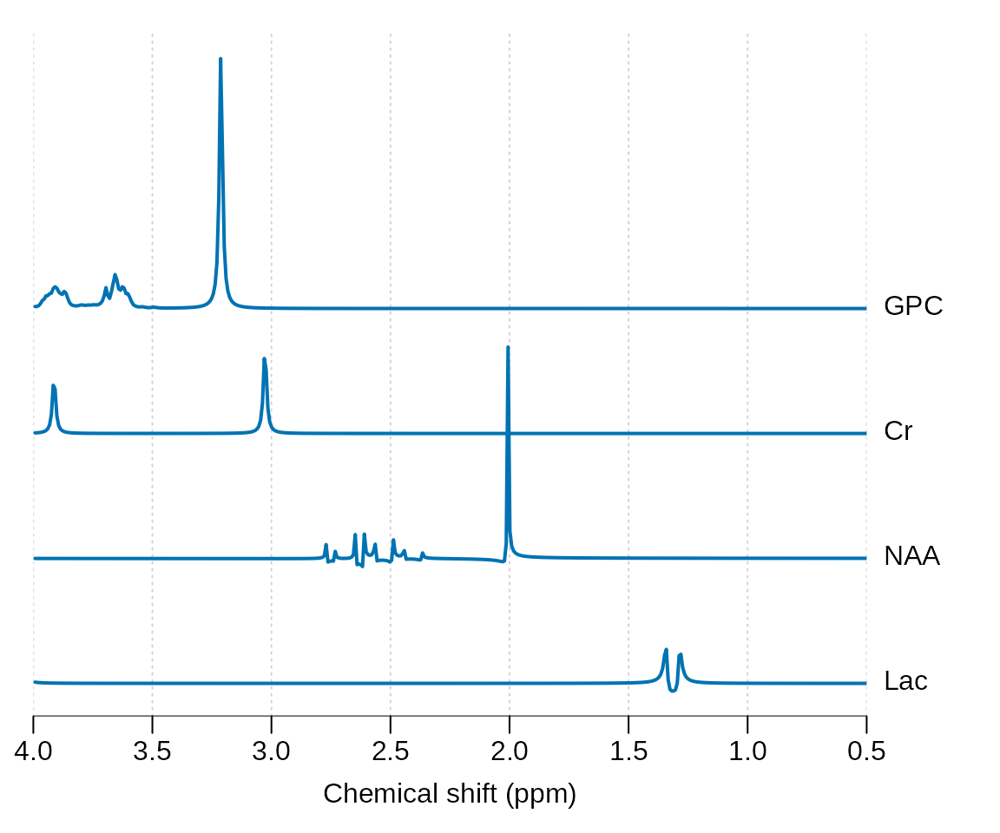
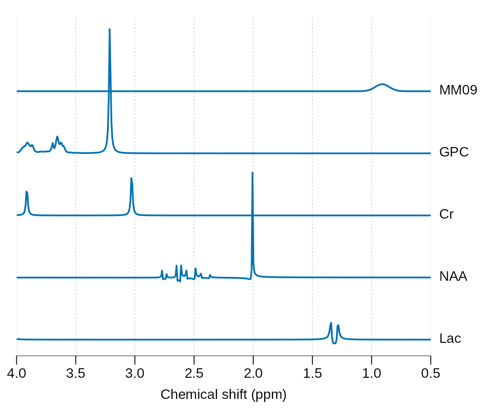
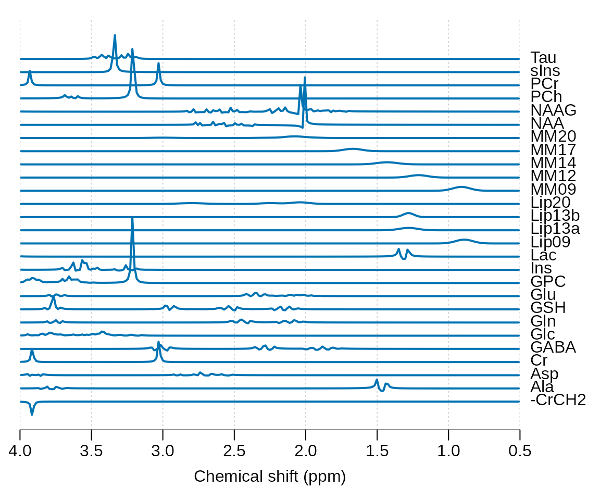

# Basis simulation

## Basis simulation

Basis simulation is necessary step for modern MRS analysis and the this
vignette will explain how to achieve this with spant. It is advisable to
follow the examples given in the [metabolite simulation
vignette](https://martin3141.github.io/spant/articles/spant-metabolite-simulation.md)
before following this guide.

Load the spant package:

``` r
library(spant)
```

A basis set is a collection of signals to be fit to the MRS data. In
spant we start with a list of molecular definitions containing the
relevant information for each signal - such as chemical shifts and
j-coupling values:

``` r
mol_list <- list(get_mol_paras("lac"),
                 get_mol_paras("naa"),
                 get_mol_paras("cr"),
                 get_mol_paras("gpc"))
```

In the next step we convert these chemical properties into a collection
of signals (a spant `basis_set` object) with the `sim_basis` function.
When fitting, the signal parameters (e.g. sampling frequency) and pulse
sequence (e.g. echo-time) must match the MRS data acquisition protocol.

``` r
basis <- sim_basis(mol_list, pul_seq = seq_slaser_ideal,
                   acq_paras = def_acq_paras(N = 2048, fs = 2000, ft = 127.8e6),
                   TE1 = 0.008, TE2 = 0.011, TE3 = 0.009)

stackplot(basis, xlim = c(4, 0.5), y_offset = 50, labels = basis$names)
```



In 1H MRS broad resonances from lipids and macromolecules are often
included in addition to metabolites:

``` r
mol_list_mm <- append(mol_list, list(get_mol_paras("MM09", ft = 127.8e6)))

basis_mm <- sim_basis(mol_list_mm, pul_seq = seq_slaser_ideal,
                   acq_paras = def_acq_paras(N = 2048, fs = 2000, ft = 127.8e6),
                   TE1 = 0.008, TE2 = 0.011, TE3 = 0.009)

stackplot(basis_mm, xlim = c(4, 0.5), y_offset = 50, labels = basis_mm$names)
```



Note the field strength is often required to simulate these broad
resonances as their linewidth is usually specified in ppm. spant also
includes the functions `sim_basis_1h_brain` and
`sim_basis_1h_brain_press` to produce commonly used sets of basis
signals:

``` r
basis <- sim_basis_1h_brain()
stackplot(basis, xlim = c(4, 0.5), y_offset = 20, labels = basis$names)
```


Basis sets can be exported for use with LCModel with the `write_basis`
function, and sim_basis_1h_brain has the option `lcm_compat` to remove
signals that are usually generated within the LCModel package:

``` r
lcm_basis <- sim_basis_1h_brain()
stackplot(lcm_basis, xlim = c(4, 0.5), y_offset = 20, labels = basis$names)
```


