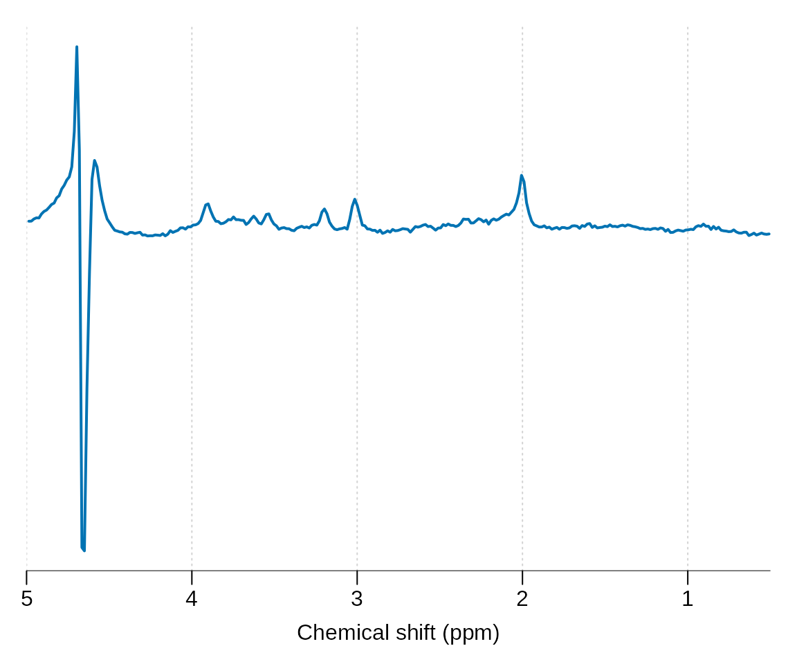
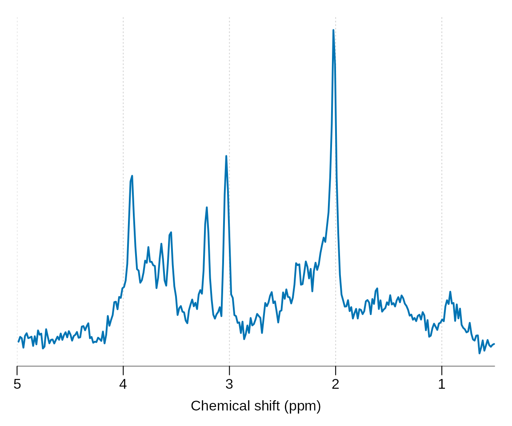
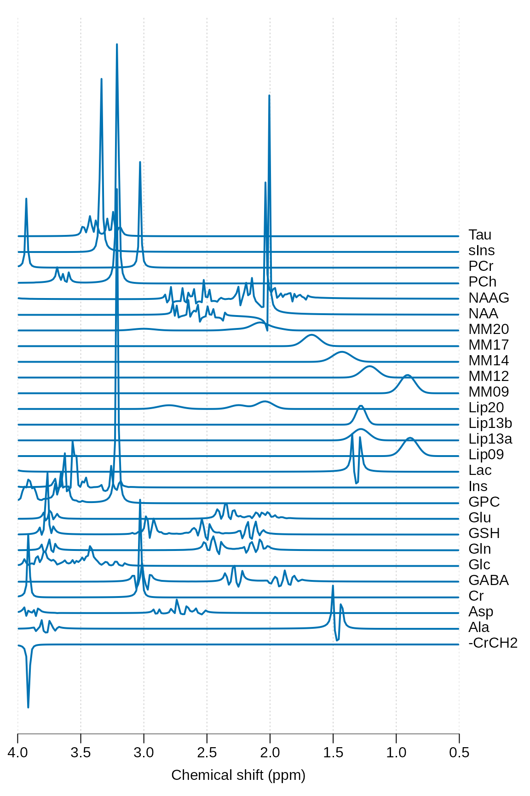
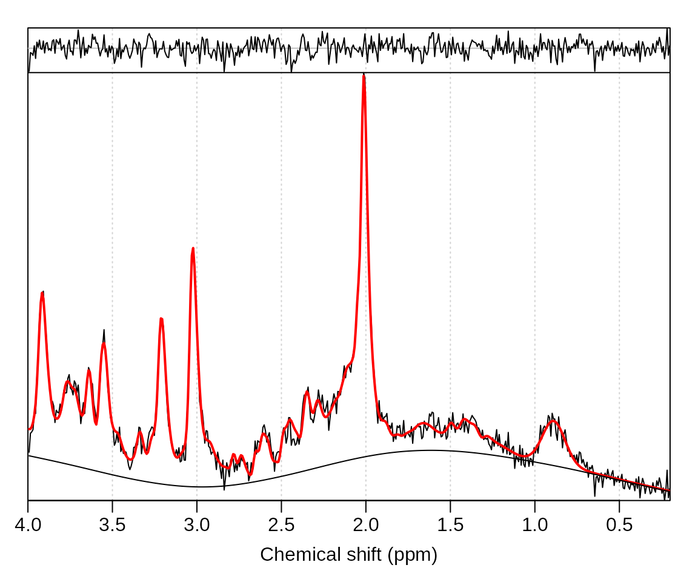

# Introduction to spant

## Reading raw data and plotting

Load the spant package:

``` r
library(spant)
```

Get the path to a data file included with spant:

``` r
fname <- system.file("extdata", "philips_spar_sdat_WS.SDAT", package = "spant")
```

Read the file and save to the workspace as `mrs_data`:

``` r
mrs_data <- read_mrs(fname)
```

Output some basic information about the data:

``` r
print(mrs_data)
#> MRS Data Parameters
#> ----------------------------------
#> Trans. freq (MHz)       : 127.7861
#> FID data points         : 1024
#> X,Y,Z dimensions        : 1x1x1
#> Dynamics                : 1
#> Coils                   : 1
#> Voxel resolution (mm)   : 20x20x20
#> Sampling frequency (Hz) : 2000
#> Repetition time (s)     : 2 
#> Reference freq. (ppm)   : 4.65
#> Nucleus                 : 1H
#> Spectral domain         : FALSE
#> Number of transients    : 128 
#> Echo time (s)           : 0.03 
#> Manufacturer            : Philips
```

Plot the spectral region between 5 and 0.5 ppm:

``` r
plot(mrs_data, xlim = c(5, 0.5))
```



## Basic preprocessing

Apply a HSVD filter to the residual water region and align the spectrum
to the tNAA resonance at 2.01 ppm:

``` r
mrs_proc <- hsvd_filt(mrs_data)
mrs_proc <- align(mrs_proc, 2.01)
plot(mrs_proc, xlim = c(5, 0.5))
```



## Basis simulation

Simulate a typical basis set for short TE brain analysis, print some
basic information and plot:

``` r
basis <- sim_basis_1h_brain_press(mrs_proc)
print(basis)
#> Basis set parameters
#> -------------------------------
#> Trans. freq (MHz)       : 127.8
#> Data points             : 1024
#> Sampling frequency (Hz) : 2000
#> Elements                : 27
#> 
#> Names
#> -------------------------------
#> -CrCH2,Ala,Asp,Cr,GABA,Glc,Gln,
#> GSH,Glu,GPC,Ins,Lac,Lip09,
#> Lip13a,Lip13b,Lip20,MM09,MM12,
#> MM14,MM17,MM20,NAA,NAAG,PCh,
#> PCr,sIns,Tau
stackplot(basis, xlim = c(4, 0.5), labels = basis$names, y_offset = 5)
```



Perform ABfit analysis of the processed data (`mrs_proc`):

``` r
fit_res <- fit_mrs(mrs_proc, basis)
```

Plot the fit result:

``` r
plot(fit_res)
```



Unscaled amplitudes, CRLB error estimates and other useful fitting
diagnostics, such as SNR, are given in the `fit_res` results table:

``` r
fit_res$res_tab
#>   X Y Z Dynamic Coil X.CrCH2          Ala          Asp           Cr
#> 1 1 1 1       1    1       0 9.363281e-06 3.329355e-05 4.021879e-05
#>           GABA          Glc          Gln          GSH          Glu          GPC
#> 1 1.691012e-05 4.038111e-06 4.651521e-06 2.169001e-05 6.727173e-05 1.610893e-05
#>            Ins          Lac        Lip09       Lip13a Lip13b Lip20         MM09
#> 1 6.027675e-05 5.931731e-06 2.340751e-05 2.821653e-06      0     0 1.008712e-05
#>           MM12         MM14        MM17        MM20          NAA         NAAG
#> 1 6.846163e-06 2.708341e-05 2.58065e-05 9.45922e-05 5.952939e-05 1.585881e-05
#>   PCh          PCr         sIns Tau        tNAA          tCr         tCho
#> 1   0 2.051219e-05 6.621263e-06   0 7.53882e-05 6.073099e-05 1.610893e-05
#>            Glx        tLM09        tLM13       tLM20   X.CrCH2.sd       Ala.sd
#> 1 7.192326e-05 3.349463e-05 3.675122e-05 9.45922e-05 2.364498e-06 4.359536e-06
#>         Asp.sd       Cr.sd      GABA.sd       Glc.sd       Gln.sd       GSH.sd
#> 1 8.966702e-06 3.74564e-06 4.456287e-06 4.324841e-06 4.893194e-06 2.018255e-06
#>         Glu.sd       GPC.sd       Ins.sd       Lac.sd     Lip09.sd    Lip13a.sd
#> 1 4.906394e-06 2.467177e-06 2.021897e-06 5.352922e-06 4.069749e-06 1.340768e-05
#>      Lip13b.sd     Lip20.sd      MM09.sd      MM12.sd      MM14.sd      MM17.sd
#> 1 6.513462e-06 7.382294e-06 3.769465e-06 4.494847e-06 7.120125e-06 3.582117e-06
#>        MM20.sd       NAA.sd      NAAG.sd       PCh.sd       PCr.sd      sIns.sd
#> 1 8.258683e-06 1.019012e-06 1.242432e-06 2.110547e-06 3.161709e-06 7.093101e-07
#>         Tau.sd      tNAA.sd       tCr.sd      tCho.sd       Glx.sd     tLM09.sd
#> 1 3.718434e-06 7.082527e-07 5.852186e-07 2.122581e-07 2.893515e-06 9.739824e-07
#>       tLM13.sd    tLM20.sd    phase       lw        shift      asym
#> 1 1.526204e-06 2.88268e-06 10.73644 5.025063 -0.003467598 0.1750151
#>   res.deviance res.niter res.info
#> 1 7.467859e-05        27        2
#>                                                        res.message bl_ed_pppm
#> 1 Relative error between `par' and the solution is at most `ptol'.   1.969325
#>   max_bl_flex_used     full_res   spec_resid fit_pts ppm_range      SNR
#> 1            FALSE 8.218013e-05 7.467859e-05     497       3.8 63.12466
#>        SRR      FQN    tNAA_lw     tCr_lw    tCho_lw auto_bl_crit_7
#> 1 51.12925 1.524261 0.04575392 0.05173419 0.05458899      -8.893571
#>   auto_bl_crit_5.901 auto_bl_crit_4.942 auto_bl_crit_4.12 auto_bl_crit_3.425
#> 1          -8.937072          -8.970754         -8.994897          -9.010328
#>   auto_bl_crit_2.844 auto_bl_crit_2.364 auto_bl_crit_1.969 auto_bl_crit_1.647
#> 1          -9.020316          -9.026533          -9.028065          -9.015726
#>   auto_bl_crit_1.384 auto_bl_crit_1.17 auto_bl_crit_0.997 auto_bl_crit_0.856
#> 1          -8.964141         -8.847346           -8.69064          -8.560648
#>   auto_bl_crit_0.743 auto_bl_crit_0.654 auto_bl_crit_0.593 auto_bl_crit_0.558
#> 1          -8.482969          -8.444754          -8.427997          -8.421008
#>   auto_bl_crit_0.54 auto_bl_crit_0.532 auto_bl_crit_0.529
#> 1         -8.418107           -8.41689          -8.416377
```

Note that signal names appended with “.sd” are the CRLB estimates for
the uncertainty (standard deviation) in the metabolite quantity
estimate. e.g. to calculate the percentage s.d. for tNAA:

``` r
fit_res$res_tab$tNAA.sd / fit_res$res_tab$tNAA * 100
#> [1] 0.9394742
```

Spectral SNR:

``` r
fit_res$res_tab$SNR
#> [1] 63.12466
```

Linewidth of the tNAA resonance in PPM:

``` r
fit_res$res_tab$tNAA_lw
#> [1] 0.04575392
```

## Ratios to total-creatine

Amplitude estimates measured by the fitting method are essentially
arbitrary unless scaled to a known reference signal. The simplest
approach for proton-MRS is to simply divide all metabolite values by
total-creatine:

``` r
fit_res_tcr_sc <- scale_amp_ratio(fit_res, "tCr")
amps <- fit_amps(fit_res_tcr_sc)
print(t(amps))
#>               [,1]
#> X.CrCH2 0.00000000
#> Ala     0.15417634
#> Asp     0.54821357
#> Cr      0.66224502
#> GABA    0.27844311
#> Glc     0.06649177
#> Gln     0.07659222
#> GSH     0.35714896
#> Glu     1.10770037
#> GPC     0.26525061
#> Ins     0.99252059
#> Lac     0.09767224
#> Lip09   0.38542939
#> Lip13a  0.04646151
#> Lip13b  0.00000000
#> Lip20   0.00000000
#> MM09    0.16609513
#> MM12    0.11272932
#> MM14    0.44595696
#> MM17    0.42493137
#> MM20    1.55756085
#> NAA     0.98021440
#> NAAG    0.26113210
#> PCh     0.00000000
#> PCr     0.33775498
#> sIns    0.10902611
#> Tau     0.00000000
#> tNAA    1.24134650
#> tCr     1.00000000
#> tCho    0.26525061
#> Glx     1.18429259
#> tLM09   0.55152453
#> tLM13   0.60514779
#> tLM20   1.55756085
```

## Water reference scaling, AKA “absolute-quantification”

A more sophisticated approach to scaling metabolite values involves the
use of a separate water-reference acquisition - which can be imported in
the standard way:

``` r
fname_wref <- system.file("extdata", "philips_spar_sdat_W.SDAT", package = "spant")
mrs_data_wref <- read_mrs(fname_wref)
```

The following code assumes the voxel contains 100% white matter tissue
and scales the metabolite values into molal (mM) units (mol / kg tissue
water) based on the method described by Gasparovic et al MRM 2006
55(6):1219-26:

``` r
p_vols <- c(WM = 100, GM = 0, CSF = 0)
TE = 0.03
TR = 2
fit_res_molal <- scale_amp_molal_pvc(fit_res, mrs_data_wref, p_vols, TE, TR)
fit_res_molal$res_tab$tNAA
#> [1] 13.91832
```

An alternative method scales the metabolite values into molar (mM) units
(mol / Litre of tissue) based on assumptions outlined in the LCModel
manual and references therein (section 10.2). This approach may be
preferred when comparing results to those obtained LCModel or TARQUIN.

``` r
fit_res_molar <- scale_amp_molar(fit_res, mrs_data_wref)
#> Warning in scale_amp_molar(fit_res, mrs_data_wref): Function name
#> (scale_amp_molar) is missleading and has been replaced with scale_amp_legacy.
fit_res_molar$res_tab$tNAA
#> [1] 6.818358
```

Note, while “absolute” units are attractive, a large number of
assumptions about metabolite and water relaxation rates are necessary to
arrive at these mM estimates. If you’re not confident at being able to
justify these assumptions, scaling to a metabolite reference (eg tCr as
above) is going to be a better option in most cases. Simple metabolite
referenced ratios also have the benefit of being more reproducible due
to the simplicity of the approach.
