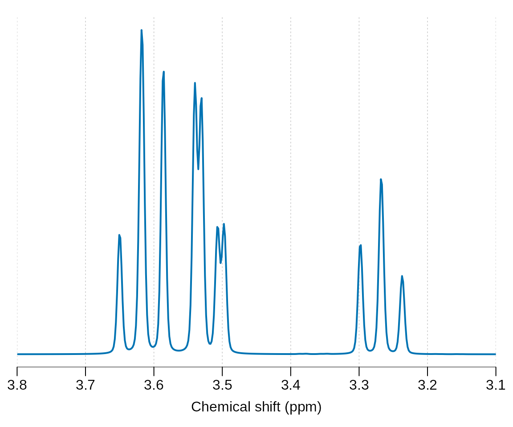
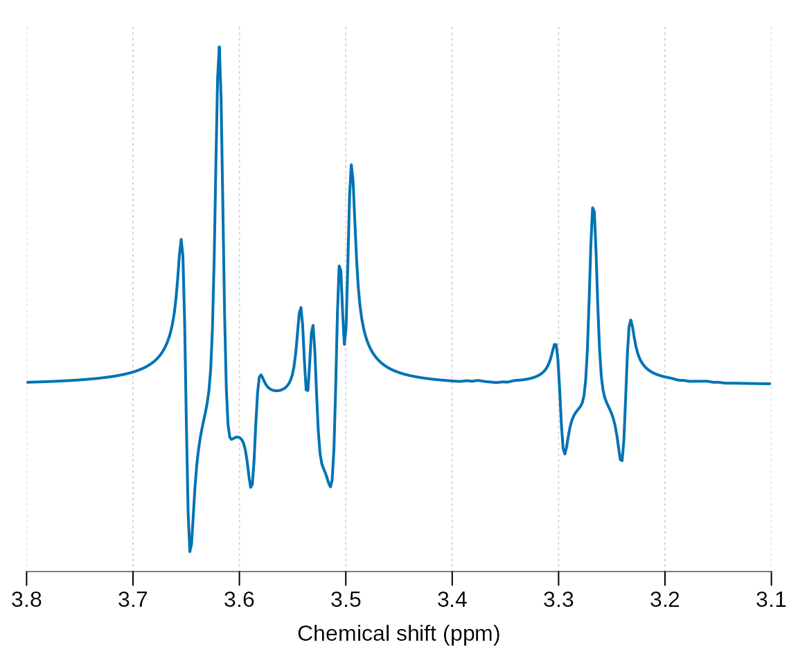
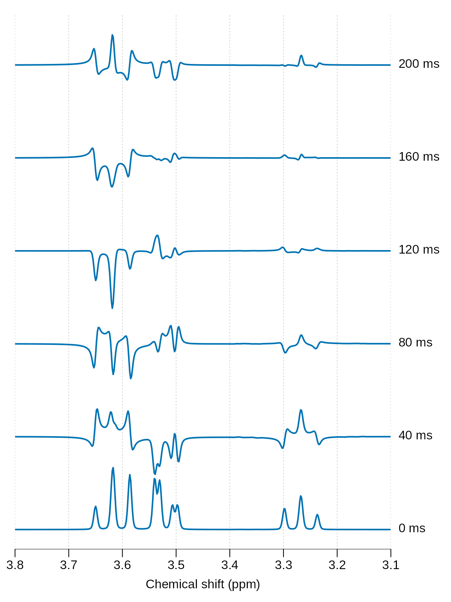
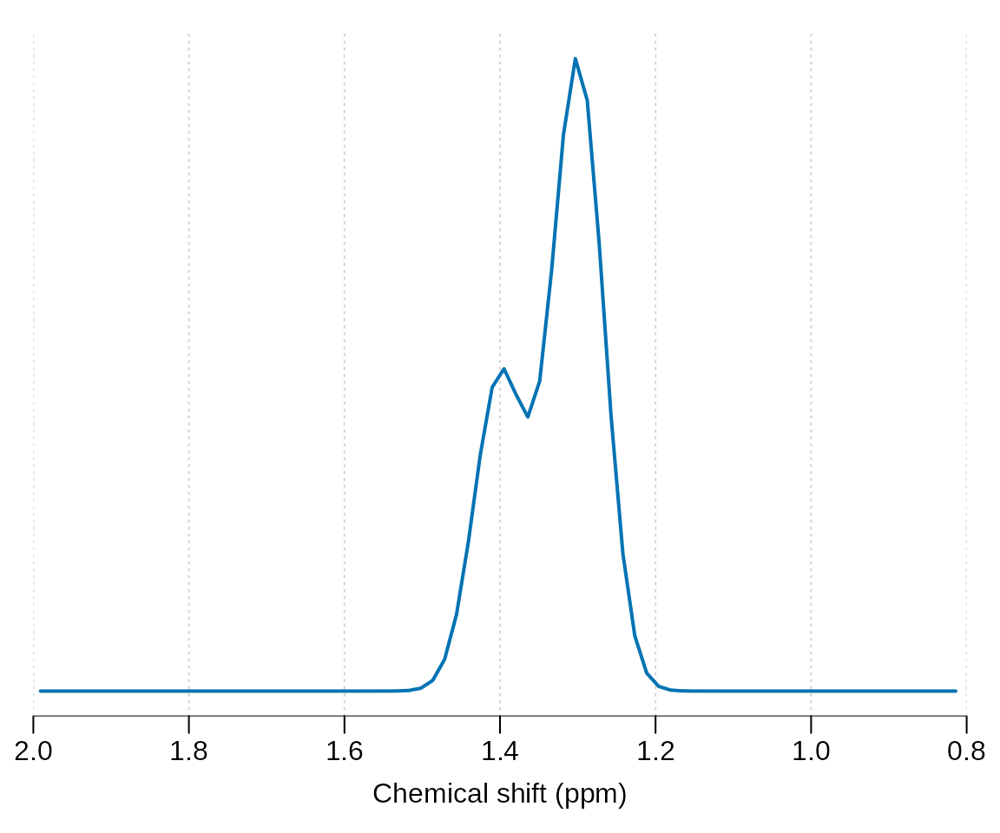
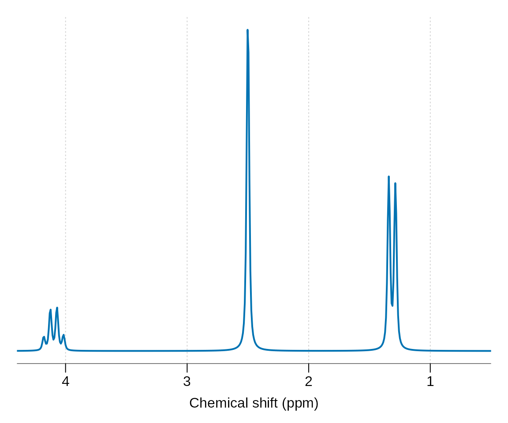

# Metabolite simulation

## Simple simulation

Load the spant package:

``` r
library(spant)
```

Output a list of pre-defined molecules available for simulation:

``` r
get_mol_names()
#>  [1] "2hg"       "a_glc"     "ace"       "ala"       "asc"       "asp"      
#>  [7] "atp_31p"   "b_glc"     "bhb"       "cho"       "cho_rt"    "cit"      
#> [13] "cr_ch2_rt" "cr_ch3_rt" "cr"        "gaba_jn"   "gaba"      "gaba_rt"  
#> [19] "glc"       "gln"       "glu"       "glu_rt"    "gly"       "glyc"     
#> [25] "gpc_31p"   "gpc"       "gpe_31p"   "gsh"       "h2o"       "ins"      
#> [31] "ins_rt"    "lac"       "lac_rt"    "lip09"     "lip13a"    "lip13b"   
#> [37] "lip20"     "lys"       "m_cr_ch2"  "mm_3t"     "mm09"      "mm12"     
#> [43] "mm14"      "mm17"      "mm20"      "msm"       "naa"       "naa_rt"   
#> [49] "naa2"      "naag_ch3"  "naag"      "nadh_31p"  "nadp_31p"  "pch_31p"  
#> [55] "pch"       "pcr_31p"   "pcr"       "pe_31p"    "peth"      "pi_31p"   
#> [61] "pyr"       "ser"       "sins"      "suc"       "tau"       "thr"      
#> [67] "val"
```

Get and print the spin system for myo-inositol:

``` r
ins <- get_mol_paras("ins")
print(ins)
#> Name        : Ins
#> Full name   : myo-Inositol
#> Spin groups : 1
#> Source      : Proton NMR chemical shifts and coupling constants for brain metabolites. NMR Biomed. 2000; 13:129-153.
#> 
#> Spin group 1
#> ------------
#> Scaling factor : 1
#> Linewidth (Hz) : 0.5
#> L/G lineshape  : 0
#> 
#>   nucleus chem_shift
#> 1      1H     3.5217
#> 2      1H     4.0538
#> 3      1H     3.5217
#> 4      1H     3.6144
#> 5      1H     3.2690
#> 6      1H     3.6144
#> 
#> j-coupling matrix
#>        3.5217 4.0538 3.5217 3.6144 3.269 3.6144
#> 3.5217      -      -      -      -     -      -
#> 4.0538  2.889      -      -      -     -      -
#> 3.5217      -  3.006      -      -     -      -
#> 3.6144      -      -  9.997      -     -      -
#> 3.269       -      -      -  9.485     -      -
#> 3.6144  9.998      -      -      - 9.482      -
```

Simulate and plot the simulation at 7 Tesla for a pulse acquire sequence
(seq_pulse_acquire), apply 2 Hz line-broadening and plot.

``` r
sim_mol(ins, ft = 300e6, N = 4096) |> lb(2) |> plot(xlim = c(3.8, 3.1))
```



Other pulse sequences may be simulated including: seq_cpmg_ideal,
seq_mega_press_ideal, seq_press_ideal, seq_slaser_ideal,
seq_spin_echo_ideal, seq_steam_ideal. Note all these sequences assume
chemical shift displacement is negligible. Next we simulate a 30 ms
spin-echo sequence and plot:

``` r
ins_sim <- sim_mol(ins, seq_spin_echo_ideal, ft = 300e6, N = 4086, TE = 0.03)
ins_sim |> lb(2) |> plot(xlim = c(3.8, 3.1))
```



Finally we simulate a range of echo-times and plot all results together
to see the phase evolution:

``` r
sim_fn <- function(TE) {
  te_sim <- sim_mol(ins, seq_spin_echo_ideal, ft = 300e6, N = 4086, TE = TE)
  lb(te_sim, 2)
}

te_vals <- seq(0, 2, 0.4)

lapply(te_vals, sim_fn) |> stackplot(y_offset = 150, xlim = c(3.8, 3.1),
                                     labels = paste(te_vals * 100, "ms"))
```



See the [basis
simulation](https://martin3141.github.io/spant/articles/spant-basis-simulation.md)
vignette for how to combine these simulations into a basis set for MRS
analysis.

## Custom molecules

For simple signals that do not require j-coupling evolution, for example
singlets or approximations to macromolecule or lipid resonances, the
`get_uncoupled_mol` function may be used. In this example we simulated
two broad Gaussian resonances at 1.3 and 1.4 ppm with differing
amplitudes:

``` r
get_uncoupled_mol("Lip13", c(1.3, 1.4), c("1H", "1H"), c(2, 1), c(10, 10),
                  c(1, 1)) |> sim_mol() |> plot(xlim = c(2, 0.8))
```



Molecules that aren’t defined within spant, or need adjusting to match a
particular scan, may be manually defined by constructing a
`mol_parameters` object. In the following code we define an imaginary
molecule based on Lactate, with the addition of a second spin group
containing a singlet at 2.5 ppm. Whilst this molecule could be defined
as a single group, it is more computationally efficient to split non
j-coupled spin systems up in this way. Note the lineshape is set to a
Lorentzian (Lorentz-Gauss factor lg = 0) with a width of 2 Hz. It is
generally a good idea to simulate resonances with narrower lineshapes
that you expect to see in experimental data, as it is far easier to make
a resonance broader than narrower.

``` r
nucleus_a <- rep("1H", 4)

chem_shift_a <- c(4.0974, 1.3142, 1.3142, 1.3142)

j_coupling_mat_a <- matrix(0, 4, 4)
j_coupling_mat_a[2,1] <- 6.933
j_coupling_mat_a[3,1] <- 6.933
j_coupling_mat_a[4,1] <- 6.933

spin_group_a <- list(nucleus = nucleus_a, chem_shift = chem_shift_a, 
                     j_coupling_mat = j_coupling_mat_a, scale_factor = 1,
                     lw = 2, lg = 0)

nucleus_b <- c("1H")
chem_shift_b <- c(2.5)
j_coupling_mat_b <- matrix(0, 1, 1)

spin_group_b <- list(nucleus = nucleus_b, chem_shift = chem_shift_b, 
                     j_coupling_mat = j_coupling_mat_b, scale_factor = 3,
                     lw = 2, lg = 0)

source <- "This text should include a reference on the origin of the chemical shift and j-coupling values."

custom_mol <- list(spin_groups = list(spin_group_a, spin_group_b), name = "Cus",
              source = source, full_name = "Custom molecule")

class(custom_mol) <- "mol_parameters"
```

In the next step we output the molecule definition as formatted text and
plot it.

``` r
print(custom_mol)
#> Name        : Cus
#> Full name   : Custom molecule
#> Spin groups : 2
#> Source      : This text should include a reference on the origin of the chemical shift and j-coupling values.
#> 
#> Spin group 1
#> ------------
#> Scaling factor : 1
#> Linewidth (Hz) : 2
#> L/G lineshape  : 0
#> 
#>   nucleus chem_shift
#> 1      1H     4.0974
#> 2      1H     1.3142
#> 3      1H     1.3142
#> 4      1H     1.3142
#> 
#> j-coupling matrix
#>        4.0974 1.3142 1.3142 1.3142
#> 4.0974      -      -      -      -
#> 1.3142  6.933      -      -      -
#> 1.3142  6.933      -      -      -
#> 1.3142  6.933      -      -      -
#> 
#> Spin group 2
#> ------------
#> Scaling factor : 3
#> Linewidth (Hz) : 2
#> L/G lineshape  : 0
#> 
#>   nucleus chem_shift
#> 1      1H        2.5
custom_mol |> sim_mol() |> lb(2) |> zf() |> plot(xlim = c(4.4, 0.5))
```



Once your happy the new molecule is correct, please consider
contributing it to the package if you think others would benefit.
