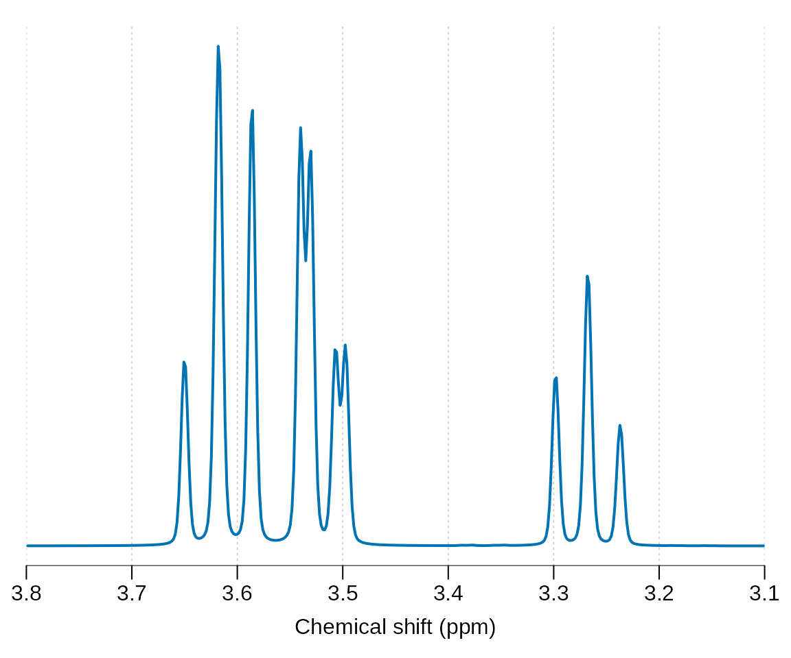
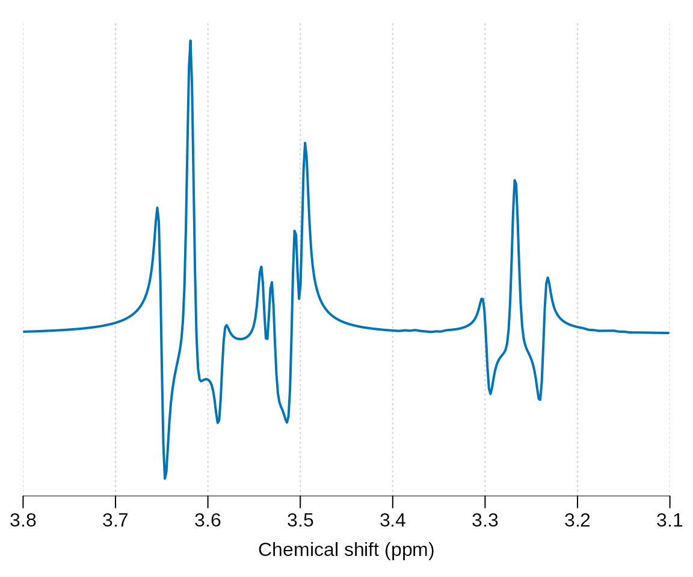
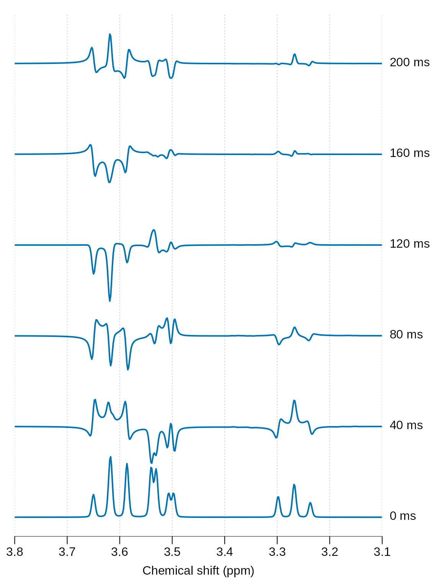
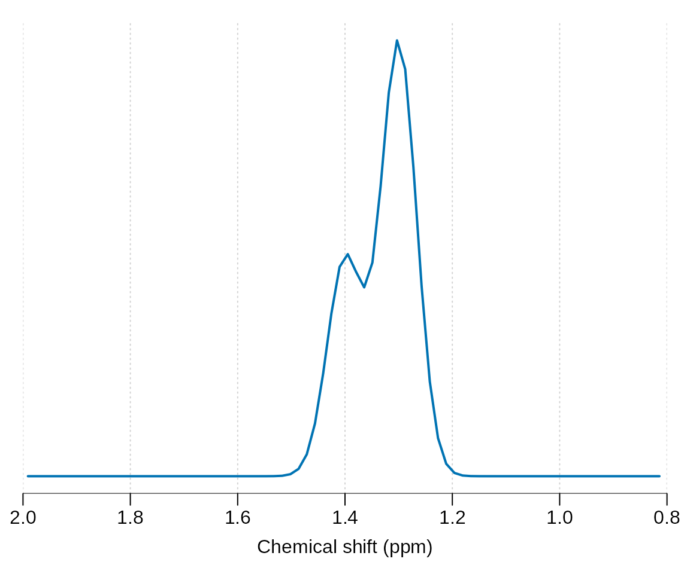
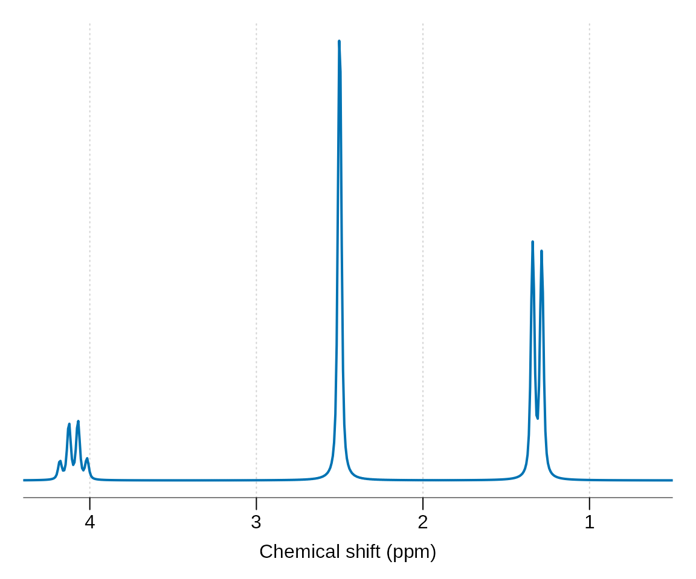

# Metabolite simulation

## Simple simulation

Load the spant package:

[`library`](https://rdrr.io/r/base/library.html)`(`[`spant`](https://spantdoc.wilsonlab.co.uk/)`)`

Output a list of pre-defined molecules available for simulation:

[`get_mol_names`](https://martin3141.github.io/spant/reference/get_mol_names.md)`(``)`` ``#> [1] "2hg" "a_glc" "ace" "ala" "asc" "asp" `` ``#> [7] "atp_31p" "b_glc" "bhb" "cho" "cho_rt" "cit" `` ``#> [13] "cr_ch2_rt" "cr_ch3_rt" "cr" "gaba_jn" "gaba" "gaba_rt" `` ``#> [19] "glc" "gln" "glu" "glu_rt" "gly" "glyc" `` ``#> [25] "gpc_31p" "gpc" "gpe_31p" "gsh" "h2o" "ins" `` ``#> [31] "ins_rt" "lac" "lac_rt" "lip09" "lip13a" "lip13b" `` ``#> [37] "lip20" "lys" "m_cr_ch2" "mm_3t" "mm09" "mm12" `` ``#> [43] "mm14" "mm17" "mm20" "msm" "naa" "naa_rt" `` ``#> [49] "naa2" "naag_ch3" "naag" "nadh_31p" "nadp_31p" "pch_31p" `` ``#> [55] "pch" "pcr_31p" "pcr" "pe_31p" "peth" "pi_31p" `` ``#> [61] "pyr" "ser" "sins" "suc" "tau" "thr" `` ``#> [67] "val"`

Get and print the spin system for myo-inositol:

`ins`` ``<-`` `[`get_mol_paras`](https://martin3141.github.io/spant/reference/get_mol_paras.md)`(``"ins"``)`` `[`print`](https://rdrr.io/r/base/print.html)`(``ins``)`` ``#> Name : Ins`` ``#> Full name : myo-Inositol`` ``#> Spin groups : 1`` ``#> Source : Proton NMR chemical shifts and coupling constants for brain metabolites. NMR Biomed. 2000; 13:129-153.`` ``#> `` ``#> Spin group 1`` ``#> ------------`` ``#> Scaling factor : 1`` ``#> Linewidth (Hz) : 0.5`` ``#> L/G lineshape : 0`` ``#> `` ``#> nucleus chem_shift`` ``#> 1 1H 3.5217`` ``#> 2 1H 4.0538`` ``#> 3 1H 3.5217`` ``#> 4 1H 3.6144`` ``#> 5 1H 3.2690`` ``#> 6 1H 3.6144`` ``#> `` ``#> j-coupling matrix`` ``#> 3.5217 4.0538 3.5217 3.6144 3.269 3.6144`` ``#> 3.5217 - - - - - -`` ``#> 4.0538 2.889 - - - - -`` ``#> 3.5217 - 3.006 - - - -`` ``#> 3.6144 - - 9.997 - - -`` ``#> 3.269 - - - 9.485 - -`` ``#> 3.6144 9.998 - - - 9.482 -`

Simulate and plot the simulation at 7 Tesla for a pulse acquire sequence
(seq_pulse_acquire), apply 2 Hz line-broadening and plot.

[`sim_mol`](https://martin3141.github.io/spant/reference/sim_mol.md)`(``ins``, ft ``=`` ``300e6``, N ``=`` ``4096``)`` ``|>`` `[`lb`](https://martin3141.github.io/spant/reference/lb.md)`(``2``)`` ``|>`` `[`plot`](https://rdrr.io/r/graphics/plot.default.html)`(``xlim ``=`` `[`c`](https://rdrr.io/r/base/c.html)`(``3.8``, ``3.1``)``)`

Other pulse sequences may be simulated including: seq_cpmg_ideal,
seq_mega_press_ideal, seq_press_ideal, seq_slaser_ideal,
seq_spin_echo_ideal, seq_steam_ideal. Note all these sequences assume
chemical shift displacement is negligible. Next we simulate a 30 ms
spin-echo sequence and plot:

`ins_sim`` ``<-`` `[`sim_mol`](https://martin3141.github.io/spant/reference/sim_mol.md)`(``ins``, ``seq_spin_echo_ideal``, ft ``=`` ``300e6``, N ``=`` ``4086``, TE ``=`` ``0.03``)`` ``ins_sim`` ``|>`` `[`lb`](https://martin3141.github.io/spant/reference/lb.md)`(``2``)`` ``|>`` `[`plot`](https://rdrr.io/r/graphics/plot.default.html)`(``xlim ``=`` `[`c`](https://rdrr.io/r/base/c.html)`(``3.8``, ``3.1``)``)`

Finally we simulate a range of echo-times and plot all results together
to see the phase evolution:

`sim_fn`` ``<-`` ``function``(``TE``)`` ``{`` `` ``te_sim`` ``<-`` `[`sim_mol`](https://martin3141.github.io/spant/reference/sim_mol.md)`(``ins``, ``seq_spin_echo_ideal``, ft ``=`` ``300e6``, N ``=`` ``4086``, TE ``=`` ``TE``)`` `` `[`lb`](https://martin3141.github.io/spant/reference/lb.md)`(``te_sim``, ``2``)`` ``}`` `` ``te_vals`` ``<-`` `[`seq`](https://rdrr.io/r/base/seq.html)`(``0``, ``2``, ``0.4``)`` `` `[`lapply`](https://rdrr.io/r/base/lapply.html)`(``te_vals``, ``sim_fn``)`` ``|>`` `[`stackplot`](https://martin3141.github.io/spant/reference/stackplot.md)`(``y_offset ``=`` ``150``, xlim ``=`` `[`c`](https://rdrr.io/r/base/c.html)`(``3.8``, ``3.1``)``,`` `` labels ``=`` `[`paste`](https://rdrr.io/r/base/paste.html)`(``te_vals`` ``*`` ``100``, ``"ms"``)``)`

See the [basis
simulation](https://martin3141.github.io/spant/articles/spant-basis-simulation.md)
vignette for how to combine these simulations into a basis set for MRS
analysis.

## Custom molecules

For simple signals that do not require j-coupling evolution, for example
singlets or approximations to macromolecule or lipid resonances, the
`get_uncoupled_mol` function may be used. In this example we simulated
two broad Gaussian resonances at 1.3 and 1.4 ppm with differing
amplitudes:

[`get_uncoupled_mol`](https://martin3141.github.io/spant/reference/get_uncoupled_mol.md)`(``"Lip13"``, `[`c`](https://rdrr.io/r/base/c.html)`(``1.3``, ``1.4``)``, `[`c`](https://rdrr.io/r/base/c.html)`(``"1H"``, ``"1H"``)``, `[`c`](https://rdrr.io/r/base/c.html)`(``2``, ``1``)``, `[`c`](https://rdrr.io/r/base/c.html)`(``10``, ``10``)``,`` `` `[`c`](https://rdrr.io/r/base/c.html)`(``1``, ``1``)``)`` ``|>`` `[`sim_mol`](https://martin3141.github.io/spant/reference/sim_mol.md)`(``)`` ``|>`` `[`plot`](https://rdrr.io/r/graphics/plot.default.html)`(``xlim ``=`` `[`c`](https://rdrr.io/r/base/c.html)`(``2``, ``0.8``)``)`

Molecules that aren’t defined within spant, or need adjusting to match a
particular scan, may be manually defined by constructing a
`mol_parameters` object. In the following code we define an imaginary
molecule based on Lactate, with the addition of a second spin group
containing a singlet at 2.5 ppm. Whilst this molecule could be defined
as a single group, it is more computationally efficient to split non
j-coupled spin systems up in this way. Note the lineshape is set to a
Lorentzian (Lorentz-Gauss factor lg = 0) with a width of 2 Hz. It is
generally a good idea to simulate resonances with narrower lineshapes
that you expect to see in experimental data, as it is far easier to make
a resonance broader than narrower.

`nucleus_a`` ``<-`` `[`rep`](https://rdrr.io/r/base/rep.html)`(``"1H"``, ``4``)`` `` ``chem_shift_a`` ``<-`` `[`c`](https://rdrr.io/r/base/c.html)`(``4.0974``, ``1.3142``, ``1.3142``, ``1.3142``)`` `` ``j_coupling_mat_a`` ``<-`` `[`matrix`](https://rdrr.io/r/base/matrix.html)`(``0``, ``4``, ``4``)`` ``j_coupling_mat_a``[``2``,``1``]`` ``<-`` ``6.933`` ``j_coupling_mat_a``[``3``,``1``]`` ``<-`` ``6.933`` ``j_coupling_mat_a``[``4``,``1``]`` ``<-`` ``6.933`` `` ``spin_group_a`` ``<-`` `[`list`](https://rdrr.io/r/base/list.html)`(``nucleus ``=`` ``nucleus_a``, chem_shift ``=`` ``chem_shift_a``, `` `` j_coupling_mat ``=`` ``j_coupling_mat_a``, scale_factor ``=`` ``1``,`` `` lw ``=`` ``2``, lg ``=`` ``0``)`` `` ``nucleus_b`` ``<-`` `[`c`](https://rdrr.io/r/base/c.html)`(``"1H"``)`` ``chem_shift_b`` ``<-`` `[`c`](https://rdrr.io/r/base/c.html)`(``2.5``)`` ``j_coupling_mat_b`` ``<-`` `[`matrix`](https://rdrr.io/r/base/matrix.html)`(``0``, ``1``, ``1``)`` `` ``spin_group_b`` ``<-`` `[`list`](https://rdrr.io/r/base/list.html)`(``nucleus ``=`` ``nucleus_b``, chem_shift ``=`` ``chem_shift_b``, `` `` j_coupling_mat ``=`` ``j_coupling_mat_b``, scale_factor ``=`` ``3``,`` `` lw ``=`` ``2``, lg ``=`` ``0``)`` `` ``source`` ``<-`` ``"This text should include a reference on the origin of the chemical shift and j-coupling values."`` `` ``custom_mol`` ``<-`` `[`list`](https://rdrr.io/r/base/list.html)`(``spin_groups ``=`` `[`list`](https://rdrr.io/r/base/list.html)`(``spin_group_a``, ``spin_group_b``)``, name ``=`` ``"Cus"``,`` `` source ``=`` ``source``, full_name ``=`` ``"Custom molecule"``)`` `` `[`class`](https://rdrr.io/r/base/class.html)`(``custom_mol``)`` ``<-`` ``"mol_parameters"`

In the next step we output the molecule definition as formatted text and
plot it.

[`print`](https://rdrr.io/r/base/print.html)`(``custom_mol``)`` ``#> Name : Cus`` ``#> Full name : Custom molecule`` ``#> Spin groups : 2`` ``#> Source : This text should include a reference on the origin of the chemical shift and j-coupling values.`` ``#> `` ``#> Spin group 1`` ``#> ------------`` ``#> Scaling factor : 1`` ``#> Linewidth (Hz) : 2`` ``#> L/G lineshape : 0`` ``#> `` ``#> nucleus chem_shift`` ``#> 1 1H 4.0974`` ``#> 2 1H 1.3142`` ``#> 3 1H 1.3142`` ``#> 4 1H 1.3142`` ``#> `` ``#> j-coupling matrix`` ``#> 4.0974 1.3142 1.3142 1.3142`` ``#> 4.0974 - - - -`` ``#> 1.3142 6.933 - - -`` ``#> 1.3142 6.933 - - -`` ``#> 1.3142 6.933 - - -`` ``#> `` ``#> Spin group 2`` ``#> ------------`` ``#> Scaling factor : 3`` ``#> Linewidth (Hz) : 2`` ``#> L/G lineshape : 0`` ``#> `` ``#> nucleus chem_shift`` ``#> 1 1H 2.5`` ``custom_mol`` ``|>`` `[`sim_mol`](https://martin3141.github.io/spant/reference/sim_mol.md)`(``)`` ``|>`` `[`lb`](https://martin3141.github.io/spant/reference/lb.md)`(``2``)`` ``|>`` `[`zf`](https://martin3141.github.io/spant/reference/zf.md)`(``)`` ``|>`` `[`plot`](https://rdrr.io/r/graphics/plot.default.html)`(``xlim ``=`` `[`c`](https://rdrr.io/r/base/c.html)`(``4.4``, ``0.5``)``)`

Once your happy the new molecule is correct, please consider
contributing it to the package if you think others would benefit.
