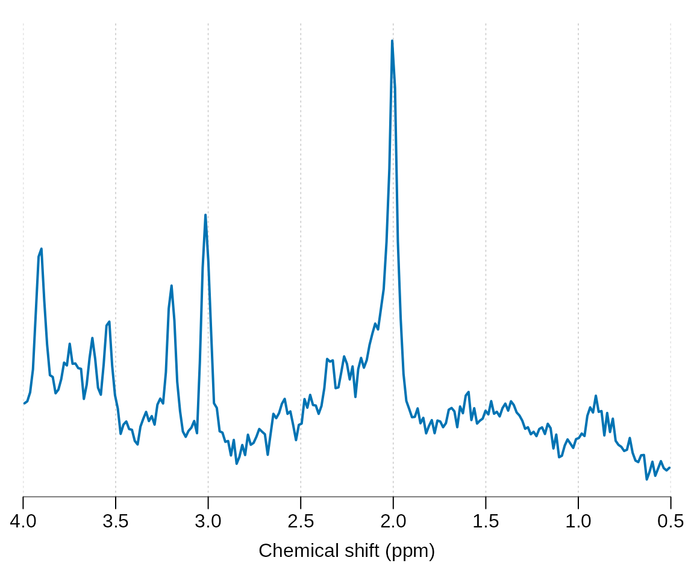
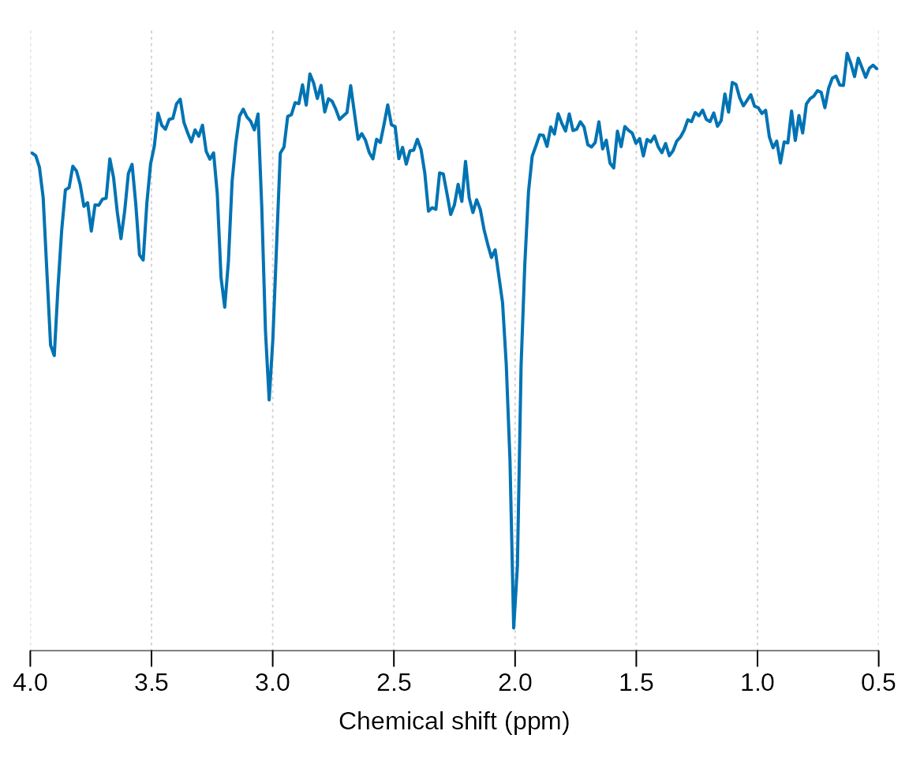
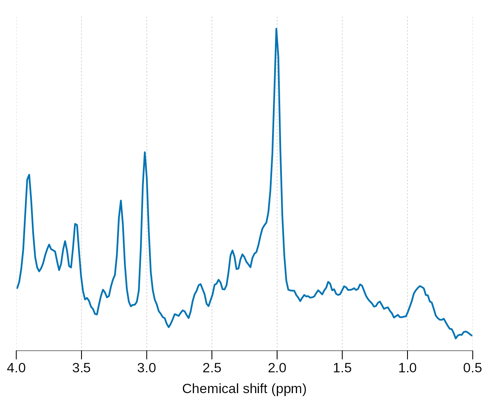
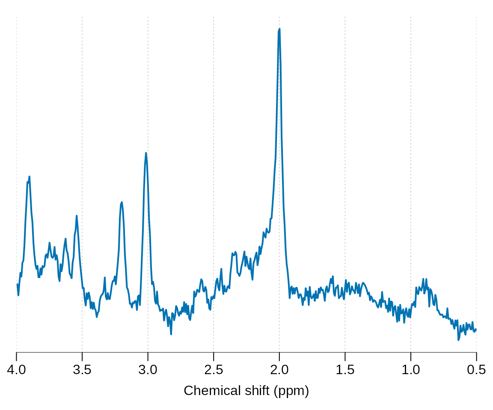
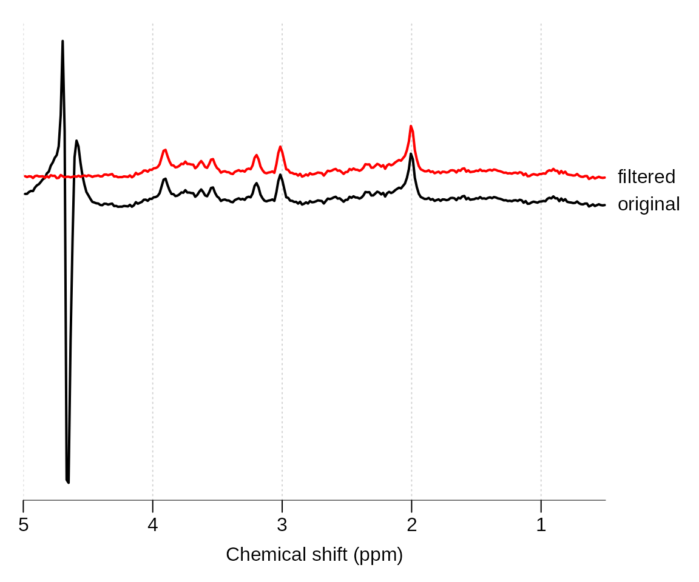
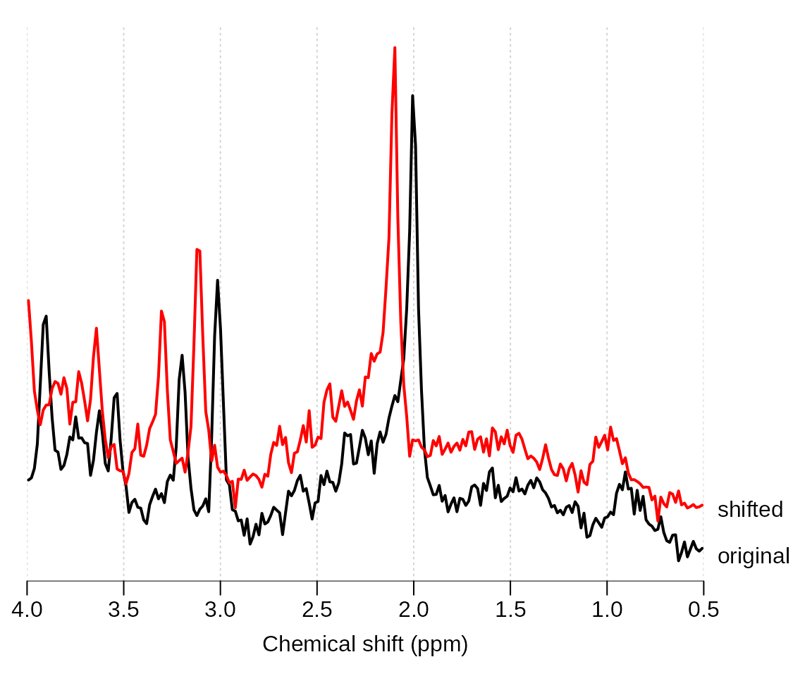
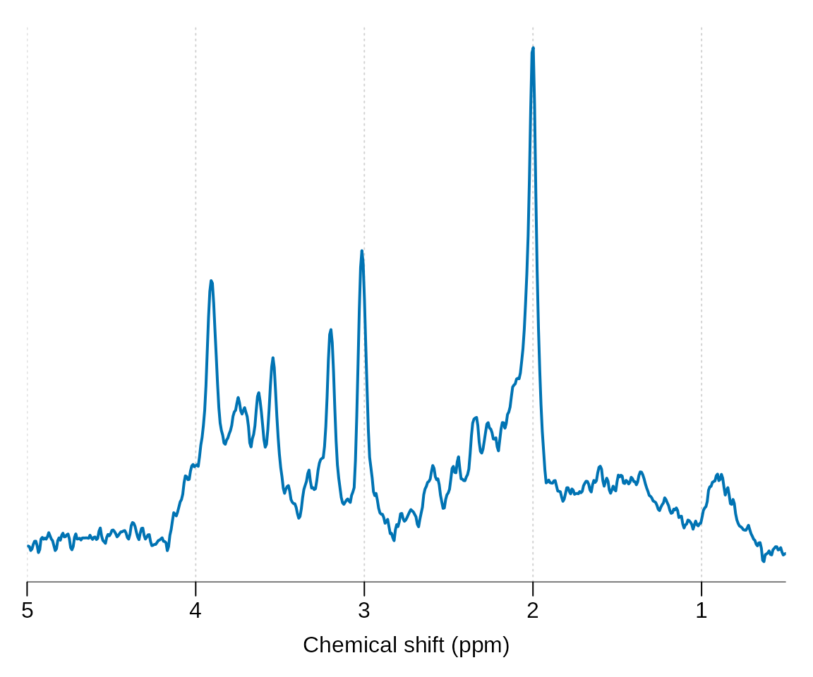

# Common preprocessing steps

## Reading raw data and plotting

Load the spant package:

``` r

library(spant)
```

Load some example data for preprocessing:

``` r

fname <- system.file("extdata", "philips_spar_sdat_WS.SDAT", package = "spant")
mrs_data <- read_mrs(fname, format = "spar_sdat")
```

Plot the spectral region between 4 and 0.5 ppm:

``` r

plot(mrs_data, xlim = c(4, 0.5))
```



Apply a 180 degree phase adjustment and plot:

``` r

mrs_data_p180 <- phase(mrs_data, 180)
plot(mrs_data_p180, xlim = c(4, 0.5))
```



Apply 3 Hz Guassian line broadening:

``` r

mrs_data_lb <- lb(mrs_data, 3)
plot(mrs_data_lb, xlim = c(4, 0.5))
```



Zero fill the data to twice the original length and plot:

``` r

mrs_data_zf <- zf(mrs_data, 2)
plot(mrs_data_zf, xlim = c(4, 0.5))
```



Apply a HSVD filter to the residual water region and plot together with
the original data:

``` r

mrs_data_filt <- hsvd_filt(mrs_data)
stackplot(list(mrs_data, mrs_data_filt), xlim = c(5, 0.5), y_offset = 10,
          col = c("black", "red"), labels = c("original", "filtered"))
```



Apply a 0.1 ppm frequency shift and plot together with the original
data:

``` r

mrs_data_shift <- shift(mrs_data, 0.1, "ppm")
stackplot(list(mrs_data, mrs_data_shift), xlim = c(4, 0.5), y_offset = 10,
          col = c("black", "red"), labels = c("original", "shifted"))
```



Multiple processing commands may be conveniently combined with the pipe
operator “\|\>” :

``` r

mrs_data_proc <- mrs_data |> hsvd_filt() |> lb(2) |> zf()
plot(mrs_data_proc, xlim = c(5, 0.5))
```


