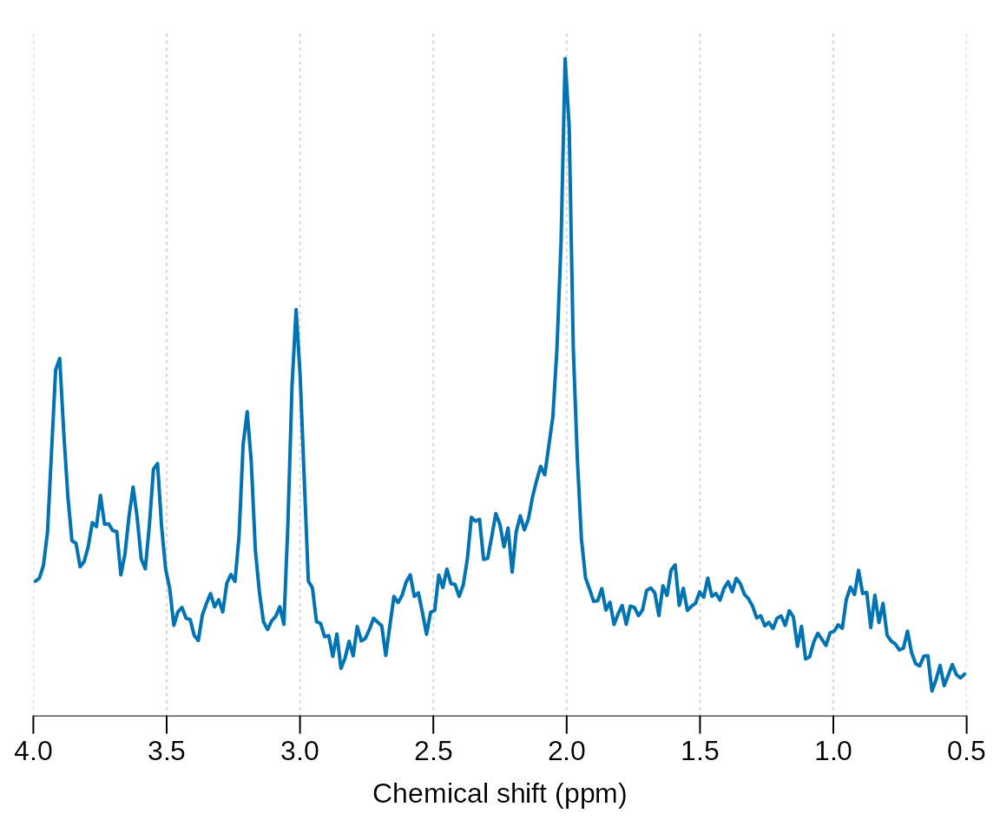
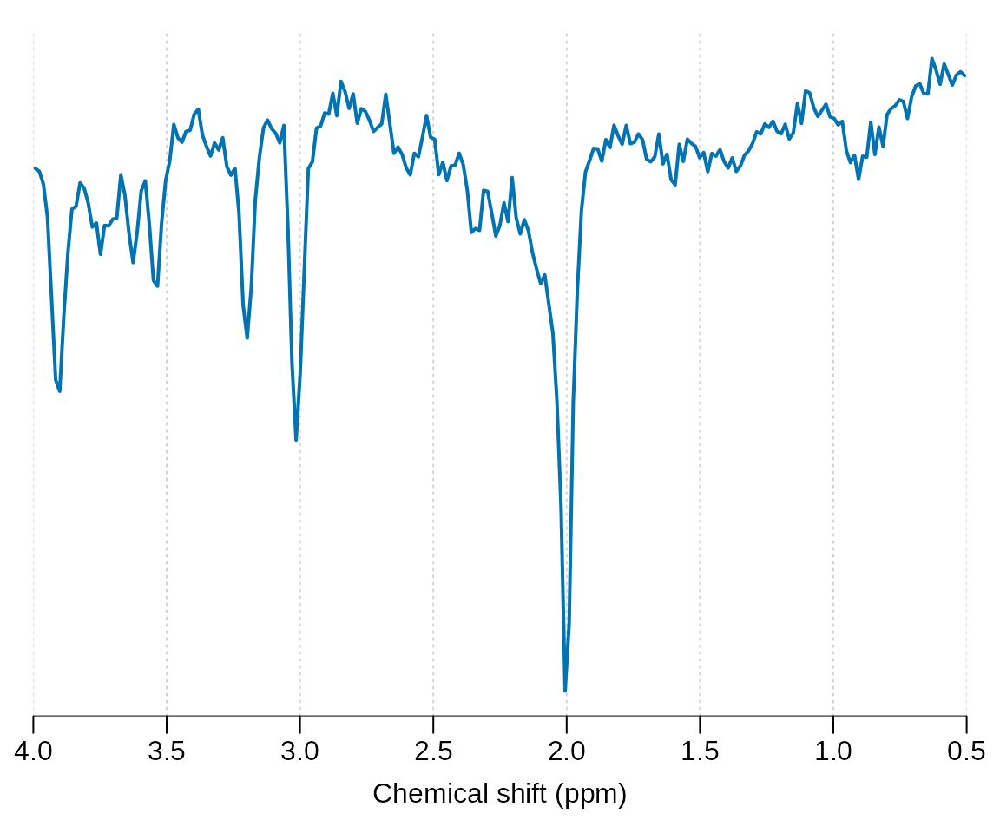
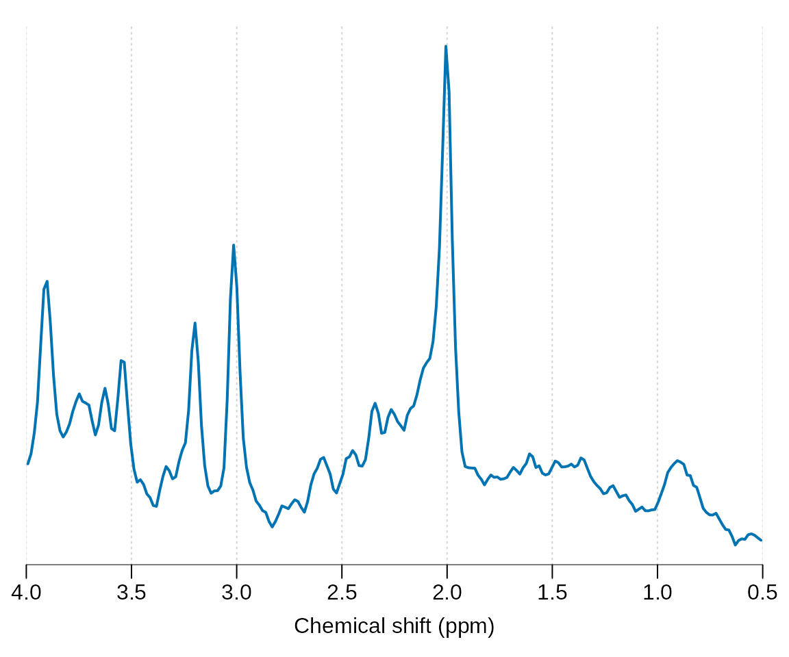
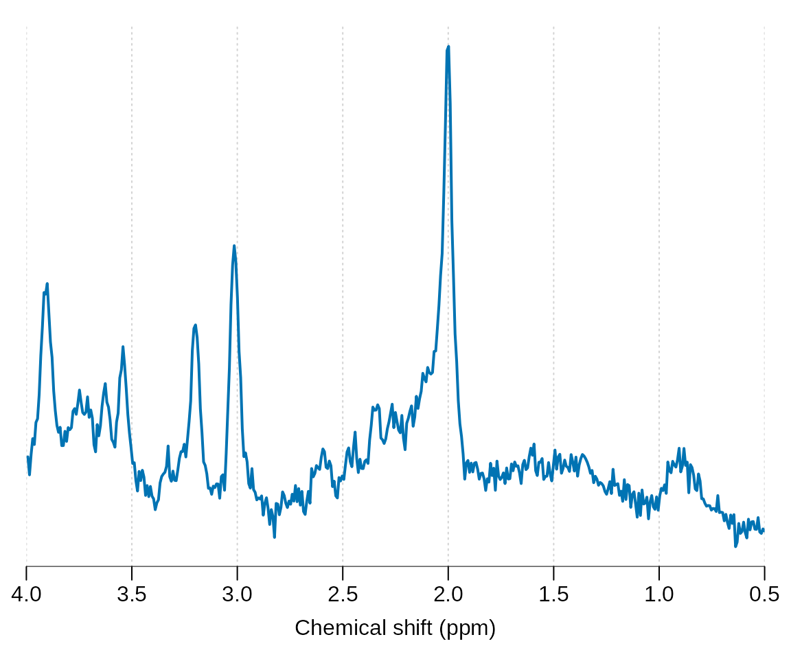
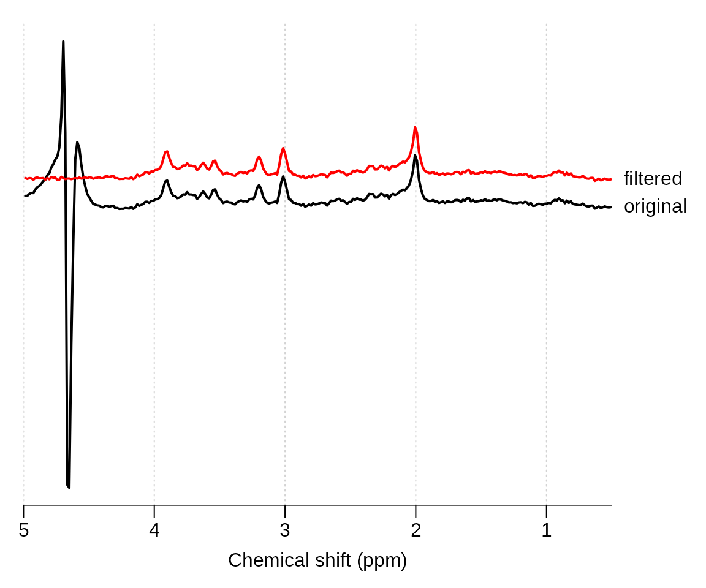
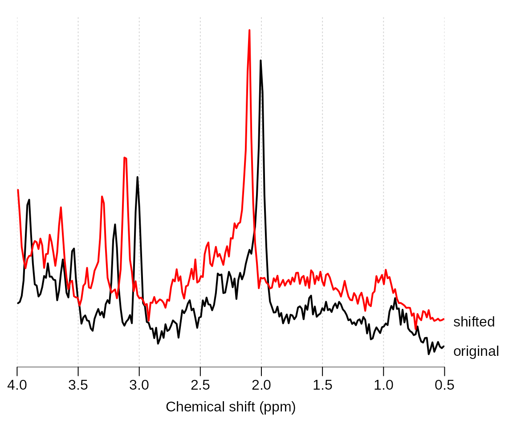
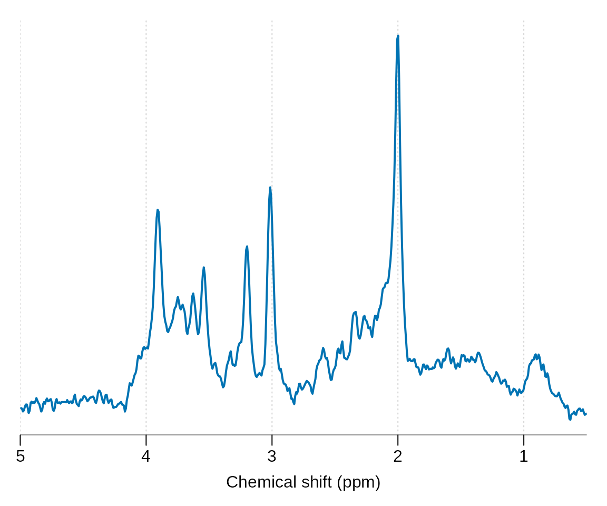

# Common preprocessing steps

## Reading raw data and plotting

Load the spant package:

[`library`](https://rdrr.io/r/base/library.html)`(`[`spant`](https://spantdoc.wilsonlab.co.uk/)`)`

Load some example data for preprocessing:

`fname`` ``<-`` `[`system.file`](https://rdrr.io/r/base/system.file.html)`(``"extdata"``, ``"philips_spar_sdat_WS.SDAT"``, package ``=`` ``"spant"``)`` ``mrs_data`` ``<-`` `[`read_mrs`](https://martin3141.github.io/spant/reference/read_mrs.md)`(``fname``, format ``=`` ``"spar_sdat"``)`

Plot the spectral region between 4 and 0.5 ppm:

[`plot`](https://rdrr.io/r/graphics/plot.default.html)`(``mrs_data``, xlim ``=`` `[`c`](https://rdrr.io/r/base/c.html)`(``4``, ``0.5``)``)`

Apply a 180 degree phase adjustment and plot:

`mrs_data_p180`` ``<-`` `[`phase`](https://martin3141.github.io/spant/reference/phase.md)`(``mrs_data``, ``180``)`` `[`plot`](https://rdrr.io/r/graphics/plot.default.html)`(``mrs_data_p180``, xlim ``=`` `[`c`](https://rdrr.io/r/base/c.html)`(``4``, ``0.5``)``)`

Apply 3 Hz Gaussian line broadening:

`mrs_data_lb`` ``<-`` `[`lb`](https://martin3141.github.io/spant/reference/lb.md)`(``mrs_data``, ``3``)`` `[`plot`](https://rdrr.io/r/graphics/plot.default.html)`(``mrs_data_lb``, xlim ``=`` `[`c`](https://rdrr.io/r/base/c.html)`(``4``, ``0.5``)``)`

Zero fill the data to twice the original length and plot:

`mrs_data_zf`` ``<-`` `[`zf`](https://martin3141.github.io/spant/reference/zf.md)`(``mrs_data``, ``2``)`` `[`plot`](https://rdrr.io/r/graphics/plot.default.html)`(``mrs_data_zf``, xlim ``=`` `[`c`](https://rdrr.io/r/base/c.html)`(``4``, ``0.5``)``)`

Apply a HSVD filter to the residual water region and plot together with
the original data:

`mrs_data_filt`` ``<-`` `[`hsvd_filt`](https://martin3141.github.io/spant/reference/hsvd_filt.md)`(``mrs_data``)`` `[`stackplot`](https://martin3141.github.io/spant/reference/stackplot.md)`(`[`list`](https://rdrr.io/r/base/list.html)`(``mrs_data``, ``mrs_data_filt``)``, xlim ``=`` `[`c`](https://rdrr.io/r/base/c.html)`(``5``, ``0.5``)``, y_offset ``=`` ``10``,`` `` col ``=`` `[`c`](https://rdrr.io/r/base/c.html)`(``"black"``, ``"red"``)``, labels ``=`` `[`c`](https://rdrr.io/r/base/c.html)`(``"original"``, ``"filtered"``)``)`

Apply a 0.1 ppm frequency shift and plot together with the original
data:

`mrs_data_shift`` ``<-`` `[`shift`](https://martin3141.github.io/spant/reference/shift.md)`(``mrs_data``, ``0.1``, ``"ppm"``)`` `[`stackplot`](https://martin3141.github.io/spant/reference/stackplot.md)`(`[`list`](https://rdrr.io/r/base/list.html)`(``mrs_data``, ``mrs_data_shift``)``, xlim ``=`` `[`c`](https://rdrr.io/r/base/c.html)`(``4``, ``0.5``)``, y_offset ``=`` ``10``,`` `` col ``=`` `[`c`](https://rdrr.io/r/base/c.html)`(``"black"``, ``"red"``)``, labels ``=`` `[`c`](https://rdrr.io/r/base/c.html)`(``"original"``, ``"shifted"``)``)`

Multiple processing commands may be conveniently combined with the pipe
operator “\|\>” :

`mrs_data_proc`` ``<-`` ``mrs_data`` ``|>`` `[`hsvd_filt`](https://martin3141.github.io/spant/reference/hsvd_filt.md)`(``)`` ``|>`` `[`lb`](https://martin3141.github.io/spant/reference/lb.md)`(``2``)`` ``|>`` `[`zf`](https://martin3141.github.io/spant/reference/zf.md)`(``)`` `[`plot`](https://rdrr.io/r/graphics/plot.default.html)`(``mrs_data_proc``, xlim ``=`` `[`c`](https://rdrr.io/r/base/c.html)`(``5``, ``0.5``)``)`

